# Architecture Diagrams

> Mermaid diagrams for visual documentation of the cluster architecture

## System Overview


## GitOps Flow


## Network Topology


## Bootstrap Sequence


## Secret Management Flow


## Application Dependency Graph


## DNS Resolution Paths

### Option A: k8s-gateway (Default)


### Option B: UniFi DNS (When unifi_host + unifi_api_key configured)

```mermaid
flowchart TB
    subgraph External["External Request"]
        ExtUser([External User])
        CloudflareDNS[Cloudflare DNS]
    end

    subgraph Internal["Internal Request"]
        IntUser([Internal User])
        UniFiDNS[UniFi Controller<br/>Native DNS]
    end

    subgraph Cluster["Kubernetes Cluster"]
        UniFiExt[unifi-dns<br/>external-dns webhook]
        EnvoyInt[envoy-internal]
        EnvoyExt[envoy-external]
        CFTunnel[cloudflared]
        App[Application]
    end

    ExtUser -->|1. DNS Query| CloudflareDNS
    CloudflareDNS -->|2. Tunnel Route| CFTunnel
    CFTunnel -->|3. HTTPS| EnvoyExt
    EnvoyExt -->|4. Route| App

    UniFiExt -.->|Writes A Records| UniFiDNS
    IntUser -->|1. DNS Query| UniFiDNS
    UniFiDNS -->|2. Resolve to IP| IntUser
    IntUser -->|3. Direct HTTPS| EnvoyInt
    EnvoyInt -->|4. Route| App
```



**Note:** UniFi DNS writes records directly to the UniFi controller, eliminating the need for split-horizon DNS configuration on your router.

## Cilium Load Balancer Modes

### DSR Mode (Default)


### SNAT Mode


## Certificate Lifecycle


## Upgrade Workflow


---

## Usage

These diagrams are rendered automatically in:

- GitHub markdown preview
- Most documentation platforms (GitBook, Docusaurus, etc.)
- VS Code with Mermaid extensions

To view locally:

```bash
# Install Mermaid CLI
npm install -g @mermaid-js/mermaid-cli

# Generate PNG
mmdc -i DIAGRAMS.md -o diagrams/
```
