# Documentation Standards for matherlynet-talos-cluster

**Purpose**: Establish consistent, high-quality documentation standards for all AI assistants working with this Talos/Kubernetes GitOps cluster.

**Scope**: These standards MUST be applied when creating:

- Comprehensive analysis documents
- Validation reports
- Implementation guides
- Architectural documentation
- Migration guides
- Troubleshooting documentation
- Any documentation intended for reference or production use

**Trigger Conditions**: Apply these standards automatically when:

- User requests "document", "analyze", "report", "validate", "assess"
- Creating .md files in `docs/` or `documentation/` directories
- Producing comprehensive technical documentation
- Generating validation or assessment reports

---

## 📋 CORE STANDARDS (MUST Apply)

### Standard 1: Evidence-Based Analysis ✅

**MUST**: All claims and findings MUST be validated through actual code inspection, command execution, or empirical testing.

**MUST**: Document the methodology used to gather evidence.

**SHOULD**: Provide verification commands so readers can independently reproduce findings.

**Pattern**:

```markdown
## Evidence Trail

| Finding | Evidence Method | Verification Command |
|---------|----------------|----------------------|
| [Claim] | [How verified] | [Command to reproduce] |
```

**Project-Specific Examples**:

```markdown
| Finding | Evidence Method | Verification Command |
|---------|----------------|----------------------|
| Cilium v1.16.5 deployed | Inspected HelmRelease | `kubectl get helmrelease -n kube-system cilium -o yaml` |
| Talos v1.12.0 installed | Checked node version | `talosctl version -n <node-ip>` |
| Templates render correctly | Ran configure task | `task configure --dry-run` |
| Flux reconciling successfully | Checked kustomization status | `flux get ks -A` |
| SOPS encryption working | Decrypted test secret | `sops -d kubernetes/flux/vars/cluster-secrets.sops.yaml` |
```

---

### Standard 2: Specific Line References ✅

**MUST**: Reference specific file paths and line numbers for all code references.

**CRITICAL**: This project uses **template files** as source of truth. Reference `templates/config/*` files, NOT generated files in `kubernetes/`, `talos/`, `infrastructure/` directories.

**SHOULD**: Provide a Quick Navigation Index for documents > 200 lines.

**Pattern**:

```markdown
## Quick Navigation Index

| Section | Location | Severity | Action Required |
|---------|----------|----------|-----------------|
| [Section Name] | Lines X-Y | 🔴/🟠/🟢 | [What to do] |
```

**Project-Specific Examples**:

```markdown
✅ CORRECT: Reference template source
Issue in `templates/config/kubernetes/apps/network/envoy-gateway/app/helmrelease.yaml.j2:42`

❌ INCORRECT: Reference generated file
Issue in `kubernetes/apps/network/envoy-gateway/app/helmrelease.yaml:42`
(This file is GENERATED - changes will be overwritten)

✅ Configuration variables:
Reference `cluster.yaml` lines or `templates/scripts/plugin.py` for computed values
```

---

### Standard 3: Complete Code Examples ✅

**MUST**: All code examples MUST be complete, copy-paste ready, and tested.

**MUST**: Add `💾 COPY-PASTE READY:` header before production-ready code blocks.

**SHOULD**: Include inline comments explaining non-obvious logic.

**SHOULD**: Use correct **makejinja delimiters** for templates.

**Template Delimiters (Critical)**:

```
Block:    #% ... %#
Variable: #{ ... }#
Comment:  #| ... #|  (SYMMETRICAL - both ends use #|)
```

**Pattern**:

```markdown
### 💾 COPY-PASTE READY: [Description]

**Instructions**: [How to use this code]

\```[language]
// Explanation of what this does
[complete, working code]
\```

**Validation**:
\```bash
[command to test this code works]
\```
```

**Project-Specific Examples**:

#### 💾 COPY-PASTE READY: Add New HelmRelease Application

**Instructions**: Create `templates/config/kubernetes/apps/<namespace>/<app>/app/helmrelease.yaml.j2`

```yaml
---
apiVersion: helm.toolkit.fluxcd.io/v2
kind: HelmRelease
metadata:
  name: #{ app_name }#
spec:
  interval: 30m
  chart:
    spec:
      chart: #{ chart_name }#
      version: #{ chart_version }#
      sourceRef:
        kind: OCIRepository
        name: #{ app_name }#
      interval: 12h
  install:
    remediation:
      retries: 3
  upgrade:
    cleanupOnFail: true
    remediation:
      retries: 3
  values:
    #| Application-specific values |#
```

**Validation**:

```bash
# Render templates
task configure

# Check generated manifest
cat kubernetes/apps/<namespace>/<app>/app/helmrelease.yaml

# Deploy and verify
task reconcile
flux get hr -n <namespace> <app>
```

#### 💾 COPY-PASTE READY: SOPS Encrypt Secret

**Instructions**: Create secret, then encrypt with Age

```bash
# Create secret file
cat > kubernetes/flux/vars/my-secret.sops.yaml <<EOF
apiVersion: v1
kind: Secret
metadata:
  name: my-secret
  namespace: default
stringData:
  username: admin
  password: changeme
EOF

# Encrypt with SOPS
sops --encrypt --in-place kubernetes/flux/vars/my-secret.sops.yaml
```

**Validation**:

```bash
# Verify encryption
head -n 10 kubernetes/flux/vars/my-secret.sops.yaml
# Should see "sops:" metadata

# Test decryption
sops -d kubernetes/flux/vars/my-secret.sops.yaml
# Should show plaintext values
```

---

### Standard 4: Validation Commands ✅

**MUST**: Provide validation commands for all recommendations.

**SHOULD**: Consolidate validation commands into a reference section.

**SHOULD**: Show expected output and failure indicators.

**Pattern**:

```markdown
## Validation Command Reference

| Command | Purpose | Expected Output | Failure Indicator |
|---------|---------|-----------------|-------------------|
| [cmd]   | [why]   | [success]       | [failure pattern] |
```

**Project-Specific Validation Commands**:

| Command | Purpose | Expected Output | Failure Indicator |
|---------|---------|-----------------|-------------------|
| `task configure` | Render templates | "Configuration complete" | Template syntax errors |
| `task reconcile` | Force Flux sync | Kustomizations reconciled | "reconciliation failed" |
| `talosctl health -n <ip>` | Check node health | All checks passing | "not ready" or timeouts |
| `flux get ks -A` | Check GitOps status | All "Applied" | "reconciliation failed" |
| `cilium status` | Check CNI health | "OK" for all components | "Degraded" or "Error" |
| `kubectl cnpg status <cluster> -n <ns>` | Check PostgreSQL | "Cluster in healthy state" | "Not ready" pods |
| `hubble observe --verdict DROPPED` | Check network policies | Empty (no drops) | Packets being dropped |
| `sops -d <file>.sops.yaml` | Verify SOPS encryption | Decrypted content | "Failed to decrypt" |
| `talosctl validate --config talos/<node>/controlplane.yaml` | Validate Talos config | "validation succeeded" | Validation errors |

---

### Standard 5: Visual Elements ✅

**MUST**: Use visual elements (tables, ASCII art, emoji indicators) for quick comprehension.

**SHOULD**: Include Mermaid diagrams for complex relationships (see `docs/DIAGRAMS.md` for examples).

**SHOULD**: Use emoji consistently:

- ✅ Success/Correct
- ❌ Error/Missing/Critical
- ⚠️ Warning/Caution
- 🔴 Critical severity
- 🟠 High severity
- 🟢 Low severity/Info
- 💾 Copy-paste ready
- 🔍 Investigation/Analysis
- 📊 Metrics/Data
- 🎯 Target/Goal
- 🚀 Deployment/Action
- 🛡️ Security

**Pattern**:

```markdown
| Status | Item | Details |
|--------|------|---------|
| ✅ | [Item] | [Good] |
| ❌ | [Item] | [Problem] |
```

**Mermaid Diagram Example (GitOps Flow)**:

```mermaid
graph LR
    A[Git Commit] --> B[Flux Detects Change]
    B --> C[Reconcile Kustomization]
    C --> D{Health Check}
    D -->|Pass| E[Deployed ✅]
    D -->|Fail| F[Rollback ❌]
```



---

## 🆕 ENHANCED STANDARDS (SHOULD Apply When Relevant)

### Standard 6: CI/CD Impact Analysis ⚙️

**SHOULD**: Document how recommendations affect automation pipelines when relevant.

**When to Apply**:

- Configuration changes affecting `task configure`
- Infrastructure modifications (OpenTofu)
- Template system changes
- SOPS encryption changes

**Pattern**:

```markdown
## CI/CD Impact

### GitHub Actions Considerations
[How this affects CI pipelines]

### Task Automation
[Impact on Taskfile.yaml tasks]

### Flux Reconciliation
[How Flux will handle this change]

### Deployment Strategy
[Rollout guidance]
```

**Project-Specific Example**:

```markdown
## CI/CD Impact

### Task Automation
This change requires running `task configure` to regenerate manifests.
Automated via `.taskfiles/configure.yaml`.

### Flux Reconciliation
Flux will detect changes within 1 minute (default reconcile interval).
Use `task reconcile` to force immediate sync.

### Deployment Strategy
1. Commit changes to `templates/` directory
2. Run `task configure` locally
3. Commit generated files in `kubernetes/`
4. Push to Git
5. Flux reconciles automatically
6. Monitor: `flux get ks -A --watch`
```

---

### Standard 7: Talos/Kubernetes Patterns 🏗️

**SHOULD**: Document Talos-specific and Kubernetes-specific patterns unique to this cluster.

**When to Apply**:

- Talos configuration changes
- Kubernetes resource creation
- Helm chart deployment
- Network policy creation

**Pattern**:

```markdown
## Talos Patterns

| Pattern | Use Case | Example |
|---------|----------|---------|
| [Pattern name] | [When to use] | [Code example] |

## Kubernetes Patterns

| Pattern | Use Case | Example |
|---------|----------|---------|
| [Pattern name] | [When to use] | [Code example] |
```

**Project-Specific Patterns**:

| Pattern | Use Case | Example |
|---------|----------|---------|
| OCI HelmRelease | All Helm charts | See Standard 3 example |
| Flux Kustomization | App deployment orchestration | `templates/config/kubernetes/apps/<ns>/<app>/ks.yaml.j2` |
| SOPS Secrets | Encrypted sensitive data | `*.sops.yaml` files with Age encryption |
| Gateway API | Ingress routing | `templates/config/kubernetes/apps/network/envoy-gateway/` |
| SecurityPolicy | OIDC authentication | Gateway OIDC pattern (split internal/external endpoints) |
| CiliumNetworkPolicy | Zero-trust networking | L3/L4/L7 policies in `<app>/app/ciliumnetworkpolicy.yaml.j2` |
| CloudNativePG Cluster | PostgreSQL databases | `templates/config/kubernetes/apps/database/` |

---

### Standard 8: Failure Mode Documentation 🚨

**SHOULD**: Document known failure modes with actual error messages.

**SHOULD**: Provide step-by-step debugging procedures.

**When to Apply**:

- Troubleshooting guides
- Implementation documentation
- Configuration guides

**Pattern**:

```markdown
## Failure Mode Catalog

### FM-001: [Failure Name]

**Scenario**: [When this happens]

**Error Message**:
\```
[Actual error output]
\```

**Root Cause**: [Why it fails]

**Debug Steps**:
1. [Step 1]
2. [Step 2]

**Fix**:
\```bash
[Commands to fix]
\```
```

**Project-Specific Failure Modes**:

### FM-001: Template Rendering Failed

**Scenario**: Running `task configure` fails with Jinja2 syntax error

**Error Message**:

```
jinja2.exceptions.TemplateSyntaxError: unexpected char '#' at 42
```

**Root Cause**: Incorrect makejinja delimiters used (e.g., `{{ }}` instead of `#{ }#`)

**Debug Steps**:

1. Check error message for file path and line number
2. Inspect template file at specified line
3. Verify delimiter syntax: `#% %#` for blocks, `#{ }#` for variables, `#| |#` for comments

**Fix**:

```bash
# Correct the template delimiters
# WRONG: {{ cluster_name }}
# RIGHT: #{ cluster_name }#

# Re-run configure
task configure
```

### FM-002: Flux Kustomization Reconciliation Failed

**Scenario**: Flux cannot reconcile kustomization

**Error Message**:

```
kustomization 'flux-system/cluster' reconciliation failed:
kustomize build failed: accumulating resources:
accumulation err='accumulating resources from 'helmrelease.yaml':
evalsymlink failure on '/helmrelease.yaml'
```

**Root Cause**: Invalid Kustomization resources list or missing file

**Debug Steps**:

1. Check kustomization status: `flux get ks -A`
2. Inspect kustomization events: `kubectl describe ks <name> -n flux-system`
3. Verify all files listed in `kustomization.yaml` exist
4. Test kustomize build locally: `kustomize build kubernetes/apps/<ns>/<app>/app/`

**Fix**:

```bash
# Verify kustomization.yaml resources list
cat kubernetes/apps/<namespace>/<app>/app/kustomization.yaml

# Test kustomize build
cd kubernetes/apps/<namespace>/<app>/app/
kustomize build .

# Force reconciliation after fix
flux reconcile ks <name> -n flux-system
```

### FM-003: SOPS Decryption Failed

**Scenario**: Flux cannot decrypt SOPS-encrypted secrets

**Error Message**:

```
Failed to decrypt: no key could decrypt the data
```

**Root Cause**: Age key not available to Flux or incorrect SOPS configuration

**Debug Steps**:

1. Verify Age key secret exists: `kubectl get secret sops-age -n flux-system`
2. Check secret has correct key: `kubectl get secret sops-age -n flux-system -o yaml`
3. Verify `.sops.yaml` configuration matches Age public key
4. Test local decryption: `sops -d <file>.sops.yaml`

**Fix**:

```bash
# Verify Age key is correct
cat .sops.yaml
# Should match: age: <AGE_PUBLIC_KEY>

# Re-create Flux Age secret if needed
kubectl delete secret sops-age -n flux-system
kubectl create secret generic sops-age \
  --namespace=flux-system \
  --from-file=age.agekey=./age.key

# Force reconciliation
flux reconcile ks cluster --with-source
```

---

### Standard 9: Automated Testing 🤖

**SHOULD**: Provide automated testing scripts when possible.

**SHOULD**: Include validation scripts for common tasks.

**When to Apply**:

- Creating validation procedures
- Implementation guides with testable outcomes
- Configuration guides

**Pattern**:

```markdown
## Automated Testing

### Validation Script

**💾 COPY-PASTE READY: [Script Name]**

Save as `[filename]`:

\```bash
#!/bin/bash
[complete validation script]
\```

**Usage**:
\```bash
chmod +x [filename]
./[filename]
\```
```

**Project-Specific Testing Scripts**:

#### 💾 COPY-PASTE READY: Cluster Health Check

Save as `scripts/health-check.sh`:

```bash
#!/usr/bin/env bash
set -euo pipefail

echo "🔍 Cluster Health Check"
echo "======================="

# Talos Nodes
echo ""
echo "📊 Talos Nodes:"
kubectl get nodes -o wide

# Flux Status
echo ""
echo "📊 Flux Kustomizations:"
flux get ks -A

# Cilium Status
echo ""
echo "📊 Cilium CNI:"
cilium status --wait

# HelmReleases
echo ""
echo "📊 HelmReleases:"
flux get hr -A | grep -v "True.*Applied"

# Failed Pods
echo ""
echo "📊 Failed Pods:"
kubectl get pods -A --field-selector=status.phase!=Running,status.phase!=Succeeded

echo ""
echo "✅ Health check complete"
```

**Usage**:

```bash
chmod +x scripts/health-check.sh
./scripts/health-check.sh
```

#### 💾 COPY-PASTE READY: Template Validation

Save as `scripts/validate-templates.sh`:

```bash
#!/usr/bin/env bash
set -euo pipefail

echo "🔍 Template Validation"
echo "====================="

# Render templates
echo "📝 Rendering templates..."
task configure

# Validate Talos configs
echo ""
echo "📝 Validating Talos configs..."
for config in talos/*/controlplane.yaml talos/*/worker.yaml; do
  if [ -f "$config" ]; then
    echo "  Checking $config..."
    talosctl validate --config "$config" --mode cloud
  fi
done

# Validate Kubernetes manifests
echo ""
echo "📝 Validating Kubernetes manifests..."
kustomize build kubernetes/flux/ > /dev/null && echo "  ✅ flux/"
kustomize build kubernetes/apps/cert-manager/ > /dev/null && echo "  ✅ cert-manager/"
kustomize build kubernetes/apps/network/ > /dev/null && echo "  ✅ network/"

# Check SOPS encryption
echo ""
echo "📝 Checking SOPS encryption..."
find kubernetes -name "*.sops.yaml" | while read -r file; do
  if ! grep -q "^sops:" "$file"; then
    echo "  ❌ NOT ENCRYPTED: $file"
  fi
done

echo ""
echo "✅ Validation complete"
```

**Usage**:

```bash
chmod +x scripts/validate-templates.sh
./scripts/validate-templates.sh
```

---

## ✅ VALIDATION CHECKLIST

Before finalizing documentation, verify:

### Core Standards (MUST)

- [ ] All claims validated through evidence (Standard 1)
- [ ] Specific line references to **template files** (Standard 2)
- [ ] Code examples are copy-paste ready with correct delimiters (Standard 3)
- [ ] Validation commands included with expected outputs (Standard 4)
- [ ] Visual elements used appropriately (Standard 5)

### Enhanced Standards (SHOULD - when relevant)

- [ ] CI/CD impact documented if applicable (Standard 6)
- [ ] Talos/Kubernetes patterns documented (Standard 7)
- [ ] Failure modes documented with debugging steps (Standard 8)
- [ ] Automated testing provided when possible (Standard 9)

### Quality Checks

- [ ] Document renders correctly in markdown viewer
- [ ] All code blocks have proper syntax highlighting
- [ ] All commands tested and produce expected output
- [ ] No sensitive information (Age keys, API tokens) in examples
- [ ] Consistent emoji usage throughout
- [ ] Tables properly formatted with alignment
- [ ] Internal links verified working
- [ ] File paths reference templates/, not generated files

### Project-Specific Checks

- [ ] makejinja delimiters correct: `#% %#`, `#{ }#`, `#| |#`
- [ ] SOPS encryption verified for secrets
- [ ] Flux kustomization references validated
- [ ] Talos configuration syntax validated
- [ ] Gateway API/SecurityPolicy patterns followed for OIDC

---

## 📊 QUALITY METRICS

Track documentation quality using these metrics:

| Metric | Target | Measurement |
|--------|--------|-------------|
| Evidence Completeness | 100% | All claims have verification method |
| Line Reference Coverage | 95%+ | Code refs use template files with line numbers |
| Copy-Paste Ready Blocks | 10+ | Count 💾 markers |
| Validation Commands | 1 per recommendation | Count verification commands |
| Visual Elements | 5+ | Count tables + diagrams |
| Failure Modes | 3+ | Count documented failure modes |
| Automated Tests | 1+ | Script provided |

---

## 🎯 APPLICATION WORKFLOW

When creating comprehensive documentation:

1. **Initial Analysis**
   - Gather evidence through code inspection/command execution
   - Document methodology and tools used
   - Record all findings with verification commands

2. **Document Structure**
   - Create Quick Navigation Index (if >200 lines)
   - Use clear hierarchical sections
   - Add visual elements for quick scanning

3. **Content Development**
   - Write evidence-backed claims
   - Provide specific line references to **template files**
   - Create copy-paste ready examples with **correct delimiters**
   - Include project-specific validation commands

4. **Enhancement (when relevant)**
   - Add CI/CD impact analysis (task/Flux/OpenTofu)
   - Document Talos/Kubernetes patterns
   - Catalog failure modes with actual errors
   - Provide automated testing scripts

5. **Validation**
   - Run through checklist
   - Test all commands and code
   - Verify markdown rendering
   - Verify no template/generated file confusion
   - Calculate quality metrics

6. **Finalization**
   - Review for completeness
   - Verify no sensitive data (Age keys, tokens)
   - Add metadata (date, version)
   - File appropriately in docs/ structure

---

## 🔗 REFERENCES

- **Template System**: See `docs/ai-context/template-system.md`
- **Talos Operations**: See `docs/ai-context/talos-operations.md`
- **Flux GitOps**: See `docs/ai-context/flux-gitops.md`
- **Troubleshooting**: See `docs/TROUBLESHOOTING.md`
- **CLI Reference**: See `docs/CLI_REFERENCE.md`
- **Quick Start**: See `docs/QUICKSTART.md`

---

**Last Updated**: 2026-01-16
**Version**: 1.0
**Applies To**: All comprehensive documentation in matherlynet-talos-cluster
**Review Cycle**: Quarterly or as project evolves
