# CloudNativePG Password Rotation Pattern

**Pattern:** Managed Role Password Rotation with Automatic Sync
**Use Case:** Rotate PostgreSQL passwords for applications using CloudNativePG
**Components:** CloudNativePG Cluster, Application Pods, Reloader
**Last Updated:** January 2026

---

## Overview

CloudNativePG clusters use **managed roles** to automatically sync password changes from Kubernetes secrets to the PostgreSQL database. This pattern enables zero-downtime password rotation through declarative configuration.

### Key Features

- ✅ **Automatic Sync**: Password changes in secrets propagate to PostgreSQL automatically
- ✅ **Zero Downtime**: Pods restart gracefully via Reloader annotation
- ✅ **Declarative**: No manual SQL commands or restarts required
- ✅ **SOPS Integration**: Encrypted passwords in cluster.yaml

---

## Architecture

### Password Rotation Flow

```mermaid
sequenceDiagram
    participant User
    participant ClusterYAML as cluster.yaml
    participant Task as task configure
    participant Flux as Flux CD
    participant Secret as K8s Secret
    participant CNPG as CNPG Operator
    participant PG as PostgreSQL
    participant Reloader
    participant Pod as Application Pod

    User->>ClusterYAML: 1. Update password<br/>(SOPS encrypted)
    User->>Task: 2. task configure && reconcile
    Task->>Flux: Render templates
    Flux->>Secret: 3. Update Secret<br/>(password field)
    Secret->>CNPG: 4. Secret change detected<br/>(via watch)
    CNPG->>PG: 5. ALTER USER password<br/>(managed role sync)
    Secret->>Reloader: 6. Checksum change detected<br/>(annotation watch)
    Reloader->>Pod: 7. Trigger rolling restart
    Pod->>PG: 8. Connect with new password
    PG-->>Pod: ✓ Authentication successful
    Pod-->>User: ✓ Zero-downtime rotation complete
```



### Component Interaction


---

## Prerequisites

### 1. CloudNativePG Cluster Configuration

The PostgreSQL cluster must be configured with a **managed database** and **managed role**:

```yaml
apiVersion: postgresql.cnpg.io/v1
kind: Cluster
metadata:
  name: <component>-postgresql
spec:
  instances: 1

  bootstrap:
    initdb:
      database: <database_name>
      owner: <username>
      secret:
        name: <component>-db-secret  # Password from cluster.yaml

  managed:
    roles:
      - name: <username>
        ensure: present
        passwordSecret:
          name: <component>-db-secret
        login: true
        superuser: false
```

**Key Fields:**
- `bootstrap.initdb.owner`: Creates initial database owner
- `bootstrap.initdb.secret.name`: References secret with password
- `managed.roles`: Defines role to keep synced with secret

### 2. Application Deployment with Reloader

Application pods must have Reloader annotation to trigger restarts:

```yaml
apiVersion: apps/v1
kind: Deployment
metadata:
  name: <component>
  annotations:
    reloader.stakater.com/auto: "true"  # Auto-detects secret changes
spec:
  template:
    spec:
      containers:
        - name: <component>
          env:
            - name: DATABASE_URL
              valueFrom:
                secretKeyRef:
                  name: <component>-db-secret
                  key: uri
```

**Reloader Behavior:**
- Watches secrets referenced by pods
- Calculates checksum of secret data
- Triggers rolling restart when checksum changes

---

## Password Rotation Procedure

### Step 1: Update cluster.yaml

Edit the password variable for the component:

```yaml
# Before
<component>_db_password: "old-password-encrypted-by-sops"

# After
<component>_db_password: "new-password-encrypted-by-sops"
```

**Generate New Password:**
```bash
# Generate 32-character random password
openssl rand -base64 24
```

**Encrypt with SOPS:**
```bash
# Edit cluster.yaml with SOPS (auto-encrypts)
sops cluster.yaml

# Or use inline encryption
echo "new-password" | sops --encrypt --input-type binary --output-type binary /dev/stdin | base64
```

### Step 2: Render Templates and Apply

```bash
# Regenerate all manifests with new password
task configure

# Apply changes via Flux (or commit+push for GitOps)
task reconcile

# Alternative: Git workflow
git add -A
git commit -m "rotate: Update <component> database password"
git push
```

### Step 3: Verify Password Sync

**Check CloudNativePG Operator logs:**
```bash
kubectl logs -n cnpg-system deploy/cloudnative-pg -f | grep "password"
```

**Expected output:**
```
INFO Reconciling managed roles for cluster <component>-postgresql
INFO Updated password for user <username>
```

**Verify role in PostgreSQL:**
```bash
kubectl exec -n <namespace> <component>-postgresql-1 -c postgres -- \
  psql -U postgres -c "\du <username>"
```

### Step 4: Verify Application Restart

**Watch pod restart:**
```bash
kubectl rollout status deployment/<component> -n <namespace>
```

**Check Reloader logs:**
```bash
kubectl logs -n kube-system deploy/reloader -f | grep <component>
```

**Expected output:**
```
INFO Changes detected in secret <component>-db-secret
INFO Triggering rolling restart of deployment <component>
```

### Step 5: Validate Connectivity

**Check application logs for successful connection:**
```bash
kubectl logs -n <namespace> deploy/<component> --tail=50 | grep -i "database\|postgres\|connection"
```

**Expected:** No authentication errors, successful queries

---

## Troubleshooting

### Issue: "FATAL: password authentication failed"

**Symptoms:**
- Application pods crash-looping
- Logs show PostgreSQL authentication errors

**Causes:**
1. Password not yet synced to PostgreSQL
2. Pods using old password (not restarted)
3. Secret not updated correctly

**Resolution:**
```bash
# 1. Verify secret has new password
kubectl get secret -n <namespace> <component>-db-secret -o jsonpath='{.data.password}' | base64 -d

# 2. Check CNPG cluster status
kubectl describe cluster -n <namespace> <component>-postgresql | grep -A 10 "Managed Roles"

# 3. Force operator reconciliation
kubectl annotate cluster -n <namespace> <component>-postgresql \
  cnpg.io/reconciliationLoop="$(date +%s)" --overwrite

# 4. Force pod restart if needed
kubectl rollout restart deployment/<component> -n <namespace>
```

### Issue: Pods Not Restarting After Secret Change

**Symptoms:**
- Secret updated but pods still running
- Old password still in use

**Causes:**
1. Reloader annotation missing
2. Reloader controller not running
3. Secret not referenced in pod spec

**Resolution:**
```bash
# 1. Verify Reloader is running
kubectl get deploy -n kube-system reloader

# 2. Check deployment has annotation
kubectl get deploy -n <namespace> <component> -o yaml | grep reloader

# 3. Add annotation if missing
kubectl annotate deployment -n <namespace> <component> \
  reloader.stakater.com/auto="true" --overwrite

# 4. Manual restart if needed
kubectl rollout restart deployment/<component> -n <namespace>
```

### Issue: CNPG Operator Not Syncing Password

**Symptoms:**
- Secret updated, pods restarted, but still authentication errors
- PostgreSQL role has old password

**Causes:**
1. Managed role configuration incorrect
2. CNPG operator not watching secret
3. Secret name mismatch

**Resolution:**
```bash
# 1. Verify managed role configuration
kubectl get cluster -n <namespace> <component>-postgresql -o yaml | grep -A 20 "managed:"

# 2. Check operator logs for errors
kubectl logs -n cnpg-system deploy/cloudnative-pg --tail=100

# 3. Force password update via SQL (emergency only)
kubectl exec -n <namespace> <component>-postgresql-1 -c postgres -- \
  psql -U postgres -c "ALTER USER <username> WITH PASSWORD '<new-password>';"
```

---

## Components Using This Pattern

| Component | Namespace | Cluster Name | Secret Name |
| ----------- | ----------- | ----------- | ----------- |
| **LiteLLM** | ai-system | litellm-postgresql | litellm-db-secret |
| **Langfuse** | ai-system | langfuse-postgresql | langfuse-db-secret |
| **Obot** | ai-system | obot-postgresql | obot-db-secret |
| **Dragonfly** | cache | dragonfly-postgresql | dragonfly-db-secret |

---

## Best Practices

### Security

1. **Always Use SOPS Encryption**: Never commit plaintext passwords
2. **Generate Strong Passwords**: Minimum 24 characters, random
3. **Rotate Regularly**: Quarterly rotation recommended
4. **Audit Access**: Review who can decrypt cluster.yaml

### Operational

1. **Test in Non-Production First**: Validate rotation procedure
2. **Monitor During Rotation**: Watch logs for authentication errors
3. **Document Rotation**: Note date in commit message
4. **Backup Before Rotation**: Ensure etcd backup exists

### Automation

1. **Use GitOps Workflow**: Commit + push for audit trail
2. **Enable Reloader Auto-Discovery**: Use `reloader.stakater.com/auto: "true"`
3. **Configure Health Checks**: Ensure pods restart gracefully
4. **Set Restart Policy**: Configure `RollingUpdate` strategy

---

## Related Documentation

- **Research**: `docs/research/cnpg-managed-roles-password-rotation-jan-2026.md`
- **CloudNativePG Docs**: https://cloudnative-pg.io/documentation/
- **Reloader**: https://github.com/stakater/Reloader
- **SOPS**: https://github.com/getsops/sops

---

## Example: LiteLLM Password Rotation

**Complete workflow:**

```bash
# 1. Generate new password
NEW_PASSWORD=$(openssl rand -base64 24)

# 2. Edit cluster.yaml with SOPS
sops cluster.yaml
# Change: litellm_db_password: "old" → "new"

# 3. Apply changes
task configure
task reconcile

# 4. Monitor rotation
kubectl logs -n cnpg-system deploy/cloudnative-pg -f | grep litellm
kubectl logs -n kube-system deploy/reloader -f | grep litellm
kubectl logs -n ai-system deploy/litellm --tail=50

# 5. Verify connectivity
kubectl exec -n ai-system deploy/litellm -- \
  python -c "import psycopg2; conn = psycopg2.connect(host='litellm-postgresql-rw', database='litellm', user='litellm', password='$NEW_PASSWORD'); print('Connected!')"
```

**Expected timeline:**
- Secret update: 0-30s (Flux reconciliation)
- Password sync: 0-60s (CNPG operator)
- Pod restart: 30-120s (Reloader + rolling update)
- **Total**: 1-3 minutes

---

**Last Updated:** January 14, 2026
**Pattern Version:** 1.1.0 ([CHANGELOG](./CHANGELOG.md#pattern-cnpg-password-rotation))
**Tested With:** CloudNativePG v1.24.1, Reloader v1.1.0

### Version History
- **v1.1.0** (2026-01-14): Added Mermaid diagrams for visual learning
- **v1.0.0** (2026-01-14): Initial pattern extraction
