# RustFS IAM Setup Pattern

**Pattern:** S3-Compatible Storage Access with Least Privilege IAM
**Use Case:** Configure service accounts for applications using RustFS object storage
**Components:** RustFS (S3-compatible), Application Pods
**Last Updated:** January 2026

---

## Overview

RustFS is an S3-compatible object storage system that provides IAM-style access control. This pattern demonstrates how to create **least-privilege service accounts** for applications needing object storage.

### Key Features

- ✅ **Principle of Least Privilege**: Scoped policies per application
- ✅ **S3 API Compatible**: Works with AWS SDK, MinIO client, s3cmd
- ✅ **Policy-Based Access**: Fine-grained bucket and object permissions
- ✅ **Console UI Management**: All IAM operations via web interface (port 9001)

### Important Limitations

⚠️ **RustFS does NOT support `mc admin` commands** - All user/policy management must be done via the **RustFS Console UI** (port 9001)

---

## Architecture

### S3 Access Flow


### IAM Setup Workflow

```mermaid
flowchart LR
    subgraph Console["🖥️ RustFS Console (Port 9001)"]
        A[1. Create Policy] --> B[2. Create User]
        B --> C[3. Assign Policy]
        C --> D[4. Generate Keys]
    end

    subgraph Config["⚙️ Configuration"]
        D --> E[5. Update cluster.yaml<br/>SOPS encrypt]
        E --> F[6. task configure]
        F --> G[7. task reconcile]
    end

    subgraph Deploy["🚀 Deployment"]
        G --> H[8. Secret deployed]
        H --> I[9. App connects<br/>to RustFS]
    end

    style Console fill:#e1f5ff
    style Config fill:#fff4e1
    style Deploy fill:#e1ffe1
```



### Policy Scope Model

```mermaid
graph TB
    subgraph RustFS["🗄️ RustFS S3 Service"]
        Policy[IAM Policy<br/>app-storage]
        User[IAM User<br/>app-svc]
    end

    subgraph Buckets["📦 S3 Buckets"]
        B1[app-events]
        B2[app-media]
        B3[app-exports]
        B4[other-app-data]
    end

    Policy -->|Scoped to<br/>app-* buckets| User
    User -->|✅ Allow| B1
    User -->|✅ Allow| B2
    User -->|✅ Allow| B3
    User -->|❌ Deny| B4

    style RustFS fill:#e1f5ff
    style Buckets fill:#fff4e1
    style B4 fill:#ffe1e1
```



---

## IAM Setup Procedure

### Step 1: Access RustFS Console

**Port Forward to Console UI:**

```bash
kubectl port-forward -n storage svc/rustfs-console 9001:9001
```

**Open in Browser:**

```
http://localhost:9001
```

**Login Credentials:**

- **Username**: `admin`
- **Password**: `#{ rustfs_secret_key }#` (from cluster.yaml)

---

### Step 2: Create IAM Policy

Navigate to: **Identity** → **Policies** → **Create Policy**

**Policy Naming Convention:** `<component>-storage`

**Policy Template (Read-Write Access):**

```json
{
  "Version": "2012-10-17",
  "Statement": [
    {
      "Effect": "Allow",
      "Action": [
        "s3:GetObject",
        "s3:PutObject",
        "s3:DeleteObject",
        "s3:ListBucket"
      ],
      "Resource": [
        "arn:aws:s3:::<component>-*",
        "arn:aws:s3:::<component>-*/*"
      ]
    }
  ]
}
```

**Policy Template (Read-Only Access):**

```json
{
  "Version": "2012-10-17",
  "Statement": [
    {
      "Effect": "Allow",
      "Action": [
        "s3:GetObject",
        "s3:ListBucket"
      ],
      "Resource": [
        "arn:aws:s3:::<component>-*",
        "arn:aws:s3:::<component>-*/*"
      ]
    }
  ]
}
```

**Common S3 Actions:**

| Action | Description | Use Case |
| --------- | ------------- | ---------- |
| `s3:GetObject` | Read objects | Download files |
| `s3:PutObject` | Write objects | Upload files |
| `s3:DeleteObject` | Delete objects | Cleanup, lifecycle |
| `s3:ListBucket` | List bucket contents | Browse, sync |
| `s3:GetBucketLocation` | Get bucket region | Multi-region |
| `s3:ListAllMyBuckets` | List all buckets | Admin, discovery |

**Resource Wildcards:**

- `arn:aws:s3:::<component>-*` - All buckets starting with `<component>-`
- `arn:aws:s3:::<component>-*/*` - All objects in those buckets
- `arn:aws:s3:::<component>-events` - Specific bucket only
- `arn:aws:s3:::<component>-events/*` - All objects in specific bucket

**Click:** "Create Policy"

---

### Step 3: Create IAM User

Navigate to: **Identity** → **Users** → **Create User**

**User Naming Convention:** `<component>-svc`

**Configuration:**

- **Access Key**: `<component>-access-key` (auto-generated or custom)
- **Secret Key**: Click "Generate" or set custom
- **Status**: Enabled
- **Policy**: Select `<component>-storage` (created in Step 2)

**Click:** "Create User"

**⚠️ IMPORTANT:** Save the generated **Secret Key** - it will only be shown once!

---

### Step 4: Update cluster.yaml

Add the access credentials to `cluster.yaml`:

```yaml
# S3 Storage Configuration
<component>_s3_access_key: "<component>-access-key"
<component>_s3_secret_key: "generated-secret-key"  # Encrypt with SOPS!
```

**Encrypt with SOPS:**

```bash
# Edit cluster.yaml with SOPS (auto-encrypts sensitive fields)
sops cluster.yaml
```

---

### Step 5: Apply Configuration

```bash
# Regenerate templates with S3 credentials
task configure

# Apply changes via Flux
task reconcile

# Or commit for GitOps workflow
git add -A
git commit -m "feat: Add <component> RustFS S3 access credentials"
git push
```

---

### Step 6: Verify Access

**Test S3 Access with AWS CLI:**

```bash
# Export credentials
export AWS_ACCESS_KEY_ID="<component>-access-key"
export AWS_SECRET_ACCESS_KEY="<secret-from-cluster.yaml>"
export AWS_ENDPOINT_URL="http://rustfs-svc.storage.svc.cluster.local:9000"

# List buckets
aws s3 ls --endpoint-url $AWS_ENDPOINT_URL

# Expected output:
# <component>-events
# <component>-media
# <component>-exports

# Test read/write
echo "test" > test.txt
aws s3 cp test.txt s3://<component>-events/test.txt --endpoint-url $AWS_ENDPOINT_URL
aws s3 ls s3://<component>-events/ --endpoint-url $AWS_ENDPOINT_URL
```

**Test from Application Pod:**

```bash
kubectl exec -n <namespace> deploy/<component> -- \
  python3 -c "
import boto3
s3 = boto3.client(
    's3',
    endpoint_url='http://rustfs-svc.storage.svc.cluster.local:9000',
    aws_access_key_id='<component>-access-key',
    aws_secret_access_key='<secret>'
)
print(s3.list_buckets())
"
```

---

## Component-Specific Policy Examples

### LiteLLM (Caching + Request Logs)

**Buckets:** `litellm-cache`, `litellm-logs`

**Policy:**

```json
{
  "Version": "2012-10-17",
  "Statement": [
    {
      "Effect": "Allow",
      "Action": ["s3:GetObject", "s3:PutObject", "s3:DeleteObject", "s3:ListBucket"],
      "Resource": [
        "arn:aws:s3:::litellm-cache",
        "arn:aws:s3:::litellm-cache/*",
        "arn:aws:s3:::litellm-logs",
        "arn:aws:s3:::litellm-logs/*"
      ]
    }
  ]
}
```

---

### Langfuse (Events + Media + Exports)

**Buckets:** `langfuse-events`, `langfuse-media`, `langfuse-exports`, `langfuse-postgres-backups`

**Policy:**

```json
{
  "Version": "2012-10-17",
  "Statement": [
    {
      "Effect": "Allow",
      "Action": ["s3:GetObject", "s3:PutObject", "s3:DeleteObject", "s3:ListBucket"],
      "Resource": [
        "arn:aws:s3:::langfuse-*",
        "arn:aws:s3:::langfuse-*/*"
      ]
    }
  ]
}
```

---

### Obot (Workspaces)

**Buckets:** `obot-workspaces`

**Policy:**

```json
{
  "Version": "2012-10-17",
  "Statement": [
    {
      "Effect": "Allow",
      "Action": ["s3:GetObject", "s3:PutObject", "s3:DeleteObject", "s3:ListBucket"],
      "Resource": [
        "arn:aws:s3:::obot-workspaces",
        "arn:aws:s3:::obot-workspaces/*"
      ]
    }
  ]
}
```

---

### MCP Context Forge (PostgreSQL Backups)

**Buckets:** `mcpgateway-postgres-backups`

**Policy:**

```json
{
  "Version": "2012-10-17",
  "Statement": [
    {
      "Effect": "Allow",
      "Action": [
        "s3:ListBucket",
        "s3:GetBucketLocation"
      ],
      "Resource": [
        "arn:aws:s3:::mcpgateway-postgres-backups"
      ]
    },
    {
      "Effect": "Allow",
      "Action": [
        "s3:GetObject",
        "s3:PutObject",
        "s3:DeleteObject"
      ],
      "Resource": [
        "arn:aws:s3:::mcpgateway-postgres-backups/*"
      ]
    }
  ]
}
```

---

### Loki (Log Storage)

**Buckets:** `loki-chunks`, `loki-ruler`, `loki-admin`

**Policy:**

```json
{
  "Version": "2012-10-17",
  "Statement": [
    {
      "Effect": "Allow",
      "Action": ["s3:GetObject", "s3:PutObject", "s3:DeleteObject", "s3:ListBucket"],
      "Resource": [
        "arn:aws:s3:::loki-*",
        "arn:aws:s3:::loki-*/*"
      ]
    }
  ]
}
```

---

### Talos Backup (etcd Snapshots)

**Buckets:** `talos-backups`

**Policy:**

```json
{
  "Version": "2012-10-17",
  "Statement": [
    {
      "Effect": "Allow",
      "Action": ["s3:GetObject", "s3:PutObject", "s3:ListBucket"],
      "Resource": [
        "arn:aws:s3:::talos-backups",
        "arn:aws:s3:::talos-backups/*"
      ]
    }
  ]
}
```

---

## Troubleshooting

### Issue: "Access Denied" Errors

**Symptoms:**

- Application logs show `403 Forbidden` or `AccessDenied`
- S3 operations fail with permission errors

**Causes:**

1. Policy not assigned to user
2. Incorrect bucket name in policy
3. Missing action in policy

**Resolution:**

```bash
# 1. Verify policy assignment in RustFS Console
# Navigate to: Identity → Users → <component>-svc → Check assigned policies

# 2. Test with AWS CLI using verbose mode
aws s3 ls s3://<component>-events/ --endpoint-url http://rustfs-svc.storage.svc.cluster.local:9000 --debug

# 3. Check RustFS logs for policy evaluation
kubectl logs -n storage deploy/rustfs | grep -i "access\|denied\|policy"
```

---

### Issue: "InvalidAccessKeyId" Errors

**Symptoms:**

- Authentication fails immediately
- Application can't connect to RustFS

**Causes:**

1. Wrong access key in secret
2. User disabled in RustFS
3. SOPS decryption failed

**Resolution:**

```bash
# 1. Verify access key in secret matches RustFS
kubectl get secret -n <namespace> <component>-s3-secret -o jsonpath='{.data.access-key-id}' | base64 -d

# 2. Check user status in RustFS Console
# Navigate to: Identity → Users → <component>-svc → Status: Enabled

# 3. Verify SOPS encryption/decryption
sops -d cluster.yaml | grep "<component>_s3_secret_key"
```

---

### Issue: Buckets Not Found

**Symptoms:**

- Application logs show `NoSuchBucket`
- S3 operations fail with bucket errors

**Causes:**

1. Buckets not created yet
2. Bucket name typo in configuration
3. RustFS setup job failed

**Resolution:**

```bash
# 1. List existing buckets
kubectl exec -n storage deploy/rustfs -- mc ls local/

# 2. Check RustFS setup job logs
kubectl logs -n storage job/rustfs-setup

# 3. Manually create buckets if needed
kubectl exec -n storage deploy/rustfs -- \
  mc mb local/<component>-events local/<component>-media
```

---

## Security Best Practices

### 1. Least Privilege

- ✅ **Scope policies to specific buckets only** (`<component>-*`)
- ✅ **Grant minimum required actions** (read-only if writes not needed)
- ❌ **Avoid wildcard policies** (`arn:aws:s3:::*/*`)
- ❌ **Avoid admin permissions** (`s3:*`)

### 2. Credential Management

- ✅ **Always encrypt secrets with SOPS** before committing
- ✅ **Rotate access keys quarterly** (regenerate in RustFS Console)
- ✅ **Use distinct service accounts per application**
- ❌ **Never share credentials between components**

### 3. Audit and Monitoring

- ✅ **Review RustFS access logs** periodically
- ✅ **Monitor failed authentication attempts**
- ✅ **Document policy changes** in Git commit messages

---

## Components Using This Pattern

| Component | Namespace | Buckets | Policy Scope |
| --------- | --------- | ------- | ------------ |
| **LiteLLM** | ai-system | litellm-cache, litellm-logs | Read/Write |
| **Langfuse** | ai-system | langfuse-events, langfuse-media, langfuse-exports | Read/Write |
| **Obot** | ai-system | obot-workspaces | Read/Write |
| **MCP Context Forge** | ai-system | mcpgateway-postgres-backups | Read/Write (PostgreSQL backups) |
| **Loki** | monitoring | loki-chunks, loki-ruler, loki-admin | Read/Write |
| **Talos Backup** | kube-system | talos-backups | Write (etcd snapshots) |

---

## Related Documentation

- **RustFS Documentation**: `docs/ai-context/configuration-variables.md#rustfs`
- **Research**: `docs/research/archive/completed/rustfs-shared-storage-loki-simplescalable-jan-2026.md`
- **S3 API Reference**: https://docs.aws.amazon.com/AmazonS3/latest/API/
- **AWS IAM Policy Reference**: https://docs.aws.amazon.com/IAM/latest/UserGuide/reference_policies_elements.html

---

**Last Updated:** January 14, 2026
**Pattern Version:** 1.1.0 ([CHANGELOG](./CHANGELOG.md#pattern-rustfs-iam-setup))
**Tested With:** RustFS v1.0.0-alpha.78

### Version History

- **v1.1.0** (2026-01-14): Added Mermaid diagrams for IAM workflow visualization
- **v1.0.0** (2026-01-14): Initial pattern extraction
