# Renovate Manifest Regeneration Workflow

**Status:** 🔴 **DISABLED** (Manual trigger only)
**Workflow File:** `.github/workflows/renovate-manifest-regen.yaml`
**Created:** January 14, 2026
**Last Updated:** January 14, 2026

---

## Table of Contents

- [Overview](#overview)
- [Purpose](#purpose)
- [Current Status](#current-status)
- [How It Works](#how-it-works)
- [Testing Before Enabling](#testing-before-enabling)
- [Enabling the Workflow](#enabling-the-workflow)
- [Monitoring After Enabling](#monitoring-after-enabling)
- [Troubleshooting](#troubleshooting)
- [Disabling the Workflow](#disabling-the-workflow)
- [Technical Details](#technical-details)

---

## Overview

This GitHub Action automatically regenerates infrastructure manifests when Renovate updates template files. It implements the **Rendered Manifests Pattern** for GitOps by ensuring generated files stay synchronized with template changes.

### The Problem It Solves

When Renovate creates PRs updating version constraints in `templates/config/infrastructure/*.tf.j2`, the corresponding generated files in `infrastructure/` are NOT automatically updated. This workflow solves that problem by:

1. Detecting when Renovate modifies template files
2. Running `task configure -y` to regenerate manifests
3. Committing the generated files back to the Renovate PR
4. Allowing the PR to be complete and ready to merge

### Why It's Disabled by Default

The workflow is created in a **disabled state** to allow for:

- ✅ Testing before production use
- ✅ Verification of behavior in your specific environment
- ✅ Gradual rollout and monitoring
- ✅ Risk mitigation for automated commits

---

## Purpose

### What This Workflow Does

**Automatically:**

1. ✅ Detects changes to `templates/config/**`, `cluster.yaml`, or `nodes.yaml`
2. ✅ Verifies the PR is from Renovate bot
3. ✅ Runs `task configure -y` to regenerate manifests
4. ✅ Commits generated files to the PR branch
5. ✅ Adds workflow summary to Actions tab

**Safety Features:**

- 🔒 Only runs on Renovate PRs (`github.actor == 'renovate[bot]'`)
- 🔒 Uses `[skip ci]` in commits to prevent workflow loops
- 🔒 Concurrency control prevents multiple runs on same PR
- 🔒 Timeout limits prevent runaway processes
- 🔒 Explicit permission grants (`contents: write`)

### What This Workflow Does NOT Do

- ❌ Does NOT run on human-created PRs
- ❌ Does NOT run on non-template file changes
- ❌ Does NOT auto-merge PRs (still requires manual approval)
- ❌ Does NOT modify the template files themselves

---

## Current Status

### 🔴 DISABLED (Manual Trigger Only)

The workflow is configured to **only run via manual trigger** (`workflow_dispatch`). This means:

- ✅ Will NOT execute automatically on Renovate PRs
- ✅ Can be tested manually by triggering from Actions tab
- ✅ Safe to have in repository without risk of unexpected executions

### How to Check Status

**Method 1: Check Workflow File**

```bash
grep "^on:" .github/workflows/renovate-manifest-regen.yaml -A 10
```

**Expected Output (Disabled):**

```yaml
on:
  workflow_dispatch:
    inputs:
      pr_number: ...
  # pull_request:  ← Commented out = DISABLED
  #   types: [opened, synchronize]
```

**Method 2: Check Actions Tab**

- Navigate to: https://github.com/MatherlyNet/talos-cluster/actions
- Look for: "Renovate Manifest Regeneration (DISABLED)"
- If name includes "(DISABLED)", it's not active

---

## How It Works

### Workflow Execution Flow

```mermaid
graph TD
    A[Renovate PR Created] -->|Manual Trigger Only| B{Templates Changed?}
    B -->|No| C[Skip - No Action Needed]
    B -->|Yes| D{Is Renovate Bot?}
    D -->|No| C
    D -->|Yes| E[Run task configure -y]
    E --> F{Files Changed?}
    F -->|No| G[Log: No Changes Needed]
    F -->|Yes| H[Commit Generated Files]
    H --> I[Push to PR Branch]
    I --> J[✅ Workflow Complete]
```



### Job Breakdown

#### Job 1: `check-templates` (5 minutes timeout)

**Purpose:** Detect if template files were modified

**Steps:**

1. Checkout PR branch
2. Use `tj-actions/changed-files` to detect changes to:
   - `templates/config/**`
   - `cluster.yaml`
   - `nodes.yaml`
3. Output: `templates_changed` (true/false)

#### Job 2: `regenerate-manifests` (15 minutes timeout)

**Purpose:** Regenerate and commit manifests

**Conditions:**

- Runs only if `templates_changed == true`
- Runs only if `github.actor == 'renovate[bot]'` OR manual trigger

**Steps:**

1. Checkout PR branch
2. Setup mise (tool version manager)
3. Configure git identity
4. Run `task configure -y`
5. Detect if files changed
6. If changed: Commit and push to PR branch
7. Add workflow summary to Actions tab

---

## Testing Before Enabling

### Prerequisites

- ✅ Renovate configured and running
- ✅ At least one Renovate PR available (or create test PR)
- ✅ `task configure` works locally
- ✅ Repository has Actions enabled

### Step-by-Step Testing

#### 1. Create or Find a Test PR

**Option A: Wait for Real Renovate PR**

- Wait for Renovate to create a PR modifying `templates/config/infrastructure/**`
- Note the PR number (e.g., #123)

**Option B: Create Test PR Manually**

```bash
# Create a test branch simulating Renovate
git checkout -b renovate/test-workflow
echo "# Test change" >> templates/config/infrastructure/tofu/versions.tf.j2
git add templates/config/infrastructure/tofu/versions.tf.j2
git commit -m "test: simulate Renovate template change"
git push origin renovate/test-workflow

# Create PR via GitHub UI or gh CLI
gh pr create --title "test: Renovate workflow test" --body "Testing manifest regeneration workflow"
# Note the PR number
```

#### 2. Manually Trigger the Workflow

**Via GitHub UI:**

1. Navigate to: **Actions** tab → **Renovate Manifest Regeneration (DISABLED)**
2. Click **"Run workflow"** dropdown (right side)
3. Enter the PR number from step 1
4. Click **"Run workflow"** button
5. Wait for workflow to complete

**Via GitHub CLI:**

```bash
gh workflow run "Renovate Manifest Regeneration (DISABLED)" \
  -f pr_number=123  # Replace with your PR number
```

#### 3. Verify Workflow Execution

**Check Workflow Run:**

```bash
# View recent workflow runs
gh run list --workflow="Renovate Manifest Regeneration (DISABLED)"

# View specific run details
gh run view RUN_ID
```

**Expected Behavior:**

- ✅ Job 1 (`check-templates`) completes successfully
- ✅ Job 2 (`regenerate-manifests`) runs if templates changed
- ✅ New commit appears in PR with message: "chore(infra): regenerate manifests from Renovate template updates [skip ci]"
- ✅ Workflow summary shows success message

#### 4. Verify Generated Files

**Check PR for New Commit:**

```bash
gh pr view 123 --json commits --jq '.commits[].commit.message'
# Should show: "chore(infra): regenerate manifests..."
```

**Check File Diff:**

- Navigate to PR → **Files changed** tab
- Verify `infrastructure/versions.tf` was updated
- Verify version constraints match template changes

#### 5. Verify No Workflow Loops

**Check for Additional Workflow Runs:**

```bash
# Should NOT trigger additional runs due to [skip ci] tag
gh run list --workflow="Renovate Manifest Regeneration (DISABLED)" --limit 5
# Should only show the manual trigger, no automatic runs
```

### Troubleshooting Test Issues

#### Issue: Workflow doesn't start

**Solution:**

- Verify workflow file syntax: `gh workflow view "Renovate Manifest Regeneration (DISABLED)"`
- Check Actions are enabled in repo settings
- Verify you have permission to trigger workflows

#### Issue: `task configure` fails

**Solution:**

```bash
# Test locally first
task configure -y
# Fix any errors in templates or configuration
# Verify mise.toml has correct tool versions
```

#### Issue: No files committed

**Solution:**

- Check if templates actually changed provider versions
- Verify `task configure` generated different output
- Review workflow logs: **Actions** → workflow run → **regenerate-manifests** job

#### Issue: Permission denied when pushing

**Solution:**

- Verify workflow has `contents: write` permission (line 79 in workflow file)
- Check repository settings → Actions → Workflow permissions
- Ensure "Read and write permissions" is enabled

---

## Enabling the Workflow

### Prerequisites Before Enabling

✅ Complete all testing steps above
✅ Verify workflow works correctly via manual trigger
✅ Confirm no workflow loops occur
✅ Team is aware of the change
✅ Have a rollback plan

### Step 1: Edit Workflow File

**File:** `.github/workflows/renovate-manifest-regen.yaml`

**Changes Required:**

1. **Uncomment pull_request trigger** (lines 61-66):

**Before (Disabled):**

```yaml
  # DISABLED: Uncomment this block to enable automatic execution on Renovate PRs
  # pull_request:
  #   types: [opened, synchronize]
  #   paths:
  #     - 'templates/config/**'
  #     - 'cluster.yaml'
  #     - 'nodes.yaml'
```

**After (Enabled):**

```yaml
  # Automatic execution enabled for Renovate PRs
  pull_request:
    types: [opened, synchronize]
    paths:
      - 'templates/config/**'
      - 'cluster.yaml'
      - 'nodes.yaml'
```

1. **Update workflow name** (line 54):

**Before:**

```yaml
name: Renovate Manifest Regeneration (DISABLED)
```

**After:**

```yaml
name: Renovate Manifest Regeneration
```

1. **Update comment blocks** (optional but recommended):

Update status comments throughout the file:

- Line 10: Change "STATUS: DISABLED" to "STATUS: ENABLED"
- Line 53: Remove "DISABLED" note

### Step 2: Commit and Push Changes

```bash
git add .github/workflows/renovate-manifest-regen.yaml
git commit -m "feat(ci): enable Renovate manifest regeneration workflow

Enable automatic regeneration of infrastructure manifests when
Renovate updates template files. Workflow has been tested via
manual trigger and verified to work correctly.

Related documentation:
- docs/workflows/RENOVATE_MANIFEST_REGENERATION.md
- claudedocs/research_renovate_opentofu_best_practices_2026-01-14.md"

git push
```

### Step 3: Update This Documentation

Update the "Current Status" section at the top of this file:

- Change status from "🔴 DISABLED" to "🟢 ENABLED"
- Add "Date Enabled" field
- Update "Last Updated" date

### Step 4: Notify Team

**Sample Notification:**

```
📢 Renovate Manifest Regeneration Workflow Enabled

The automatic manifest regeneration workflow is now ACTIVE.

What this means:
✅ Renovate PRs will automatically regenerate infrastructure manifests
✅ Generated files will be committed to Renovate PRs automatically
✅ PRs will be complete and ready for review/merge

What to watch for:
👀 Monitor the first 3-5 Renovate PRs for any issues
👀 Check workflow runs in Actions tab
👀 Report any problems immediately

Documentation: docs/workflows/RENOVATE_MANIFEST_REGENERATION.md
```

---

## Monitoring After Enabling

### What to Monitor

#### First 24 Hours

- [ ] First Renovate PR triggers workflow correctly
- [ ] Workflow completes successfully
- [ ] Generated files committed to PR
- [ ] No workflow loops detected
- [ ] No permission errors

#### First Week

- [ ] Multiple Renovate PRs process correctly
- [ ] Auto-merge works with regenerated files
- [ ] No failed workflow runs
- [ ] Team feedback is positive

#### Ongoing

- [ ] Weekly review of failed workflow runs
- [ ] Monitor for workflow performance issues
- [ ] Check for any false positives/negatives

### Monitoring Commands

```bash
# View recent workflow runs
gh run list --workflow="Renovate Manifest Regeneration" --limit 10

# View failed runs only
gh run list --workflow="Renovate Manifest Regeneration" --status=failure

# View specific run details
gh run view RUN_ID --log

# Check Renovate PRs with manifest commits
gh pr list --author renovate[bot] --state open
```

### Key Metrics to Track

| Metric | Target | How to Check |
| -------- | -------- | -------------- |
| Success Rate | >95% | Actions tab → workflow runs |
| Average Runtime | <5 minutes | Workflow run durations |
| Failed Runs | 0 per week | Filter by status=failure |
| Workflow Loops | 0 | Check for repeated commits |

---

## Troubleshooting

### Common Issues

#### Issue 1: Workflow doesn't trigger on Renovate PR

**Symptoms:**

- Renovate PR created
- Template files modified
- No workflow run appears in Actions tab

**Diagnosis:**

```bash
# Check if workflow is enabled
grep "^on:" .github/workflows/renovate-manifest-regen.yaml -A 10
# Should show uncommented pull_request trigger

# Check if paths match
gh pr view PR_NUMBER --json files --jq '.files[].path'
# Should include templates/config/ files
```

**Solutions:**

1. Verify pull_request trigger is uncommented
2. Check paths match workflow file patterns
3. Verify Actions are enabled in repo settings
4. Check workflow file syntax is valid

#### Issue 2: Workflow fails at "task configure" step

**Symptoms:**

- Workflow starts successfully
- Fails during `task configure -y` step
- Error in workflow logs

**Diagnosis:**

```bash
# Test locally
git checkout renovate/pr-branch
task configure -y
# Check for errors
```

**Solutions:**

1. Fix template syntax errors
2. Verify mise.toml tool versions are correct
3. Check age.key file exists (required for SOPS)
4. Verify all required secrets/variables are set

#### Issue 3: "No changes detected" but files should have changed

**Symptoms:**

- Workflow completes successfully
- Says "No changes needed"
- But manual `task configure` produces changes

**Diagnosis:**

```bash
# Check if workflow checked out correct branch
# View workflow logs: Actions → run → check-templates → log

# Test locally on same branch
git checkout renovate/pr-branch
task configure -y
git diff
```

**Solutions:**

1. Verify workflow checkout uses correct PR ref
2. Check concurrency group isn't cancelling runs
3. Verify template files actually changed in PR

#### Issue 4: Permission denied when pushing

**Symptoms:**

- Workflow fails at "Commit generated files" step
- Error: "Permission denied" or "Authentication failed"

**Diagnosis:**

```bash
# Check workflow permissions
grep "permissions:" .github/workflows/renovate-manifest-regen.yaml -A 5
# Should show: contents: write
```

**Solutions:**

1. Verify `contents: write` permission in workflow file
2. Check repo settings → Actions → Workflow permissions
3. Enable "Read and write permissions" if restricted

#### Issue 5: Workflow loops (triggers itself repeatedly)

**Symptoms:**

- Workflow commits files
- Commits trigger another workflow run
- Infinite loop of runs

**Diagnosis:**

```bash
# Check commit messages
gh pr view PR_NUMBER --json commits --jq '.commits[].commit.message'
# Should all include: [skip ci]
```

**Solutions:**

1. Verify `[skip ci]` tag is in commit message (line 173 of workflow)
2. Check commit message template hasn't been modified
3. Temporarily disable workflow if loop active
4. Manual fix: Close and reopen PR to break loop

#### Issue 6: Workflow fails silently (no error message)

**Symptoms:**

- Workflow shows as "completed"
- No generated files committed
- No clear error message

**Diagnosis:**

```bash
# View full workflow logs
gh run view RUN_ID --log

# Check for skipped jobs
gh run view RUN_ID --json jobs --jq '.jobs[] | select(.conclusion == "skipped")'
```

**Solutions:**

1. Check job conditions (needs.check-templates.outputs.templates_changed)
2. Verify actor is 'renovate[bot]'
3. Review "if" conditions in workflow file

---

## Disabling the Workflow

### When to Disable

- 🚨 Critical bug discovered
- 🚨 Workflow looping detected
- 🚨 Causing merge conflicts
- 🚨 Team requests pause for troubleshooting

### Quick Disable (Emergency)

**Method 1: Comment out trigger** (Fastest)

```bash
# Edit .github/workflows/renovate-manifest-regen.yaml
# Comment out lines 62-67 (pull_request trigger)

git add .github/workflows/renovate-manifest-regen.yaml
git commit -m "fix(ci): temporarily disable Renovate manifest regeneration workflow"
git push
```

**Method 2: Disable via GitHub UI**

1. Navigate to: **Settings** → **Actions** → **General**
2. Scroll to **Workflow permissions**
3. Find workflow in list
4. Click **Disable**

### Proper Disable (Planned)

1. Notify team of planned disable
2. Wait for current workflow runs to complete
3. Comment out pull_request trigger in workflow file
4. Change workflow name back to include "(DISABLED)"
5. Update this documentation status to "🔴 DISABLED"
6. Commit and push changes
7. Notify team of completion

---

## Technical Details

### Workflow Configuration

| Setting | Value | Reason |
| --------- | ------- | -------- |
| Timeout (check-templates) | 5 minutes | File change detection is fast |
| Timeout (regenerate) | 15 minutes | task configure can be slow |
| Concurrency group | PR number | One run per PR |
| Cancel in progress | Yes | Save CI resources |
| Permissions | contents: write | Required to push commits |
| Runner | ubuntu-latest | Standard GitHub runner |

### File Paths Monitored

| Path | Reason |
| ------ | -------- |
| `templates/config/**` | All template files |
| `cluster.yaml` | Cluster configuration |
| `nodes.yaml` | Node definitions |

### Generated Files Committed

| Directory | Contents |
| ------ | ---------- |
| `infrastructure/` | OpenTofu/Terraform files |
| `talos/` | Talos machine configs |
| `bootstrap/` | Bootstrap resources |
| `kubernetes/` | Kubernetes manifests (if modified) |

### Commit Message Template

```
chore(infra): regenerate manifests from Renovate template updates [skip ci]

Automatically regenerated by renovate-manifest-regen workflow.

This commit updates generated infrastructure/talos/bootstrap/kubernetes/
files to reflect changes made by Renovate to template files.

Triggered by: PR #123
Workflow run: https://github.com/.../actions/runs/...
```

### Safety Mechanisms

1. **Actor Check:** Only runs for `renovate[bot]` user
2. **Path Filter:** Only triggers on template file changes
3. **Skip CI Tag:** `[skip ci]` prevents workflow loops
4. **Concurrency Control:** Prevents parallel runs on same PR
5. **Timeout Limits:** Prevents runaway processes
6. **Change Detection:** Only commits if files actually changed
7. **Explicit Permissions:** Requires contents: write

### Dependencies

| Tool | Purpose | Installed By |
| ------ | --------- | -------------- |
| mise | Tool version manager | mise-action |
| task | Task runner | mise (via .mise.toml) |
| opentofu | Infrastructure generation | mise |
| talosctl | Talos config generation | mise |
| makejinja | Template rendering | mise |
| git | Version control | Ubuntu runner (pre-installed) |

### Workflow Triggers

#### Automatic (When Enabled)

```yaml
pull_request:
  types: [opened, synchronize]
  paths:
    - 'templates/config/**'
    - 'cluster.yaml'
    - 'nodes.yaml'
```

**Trigger Events:**

- `opened`: New PR created
- `synchronize`: New commits pushed to PR

**Path Filters:**

- Only triggers if specified paths modified
- Reduces unnecessary runs

#### Manual (Always Available)

```yaml
workflow_dispatch:
  inputs:
    pr_number:
      description: 'Pull Request number to process (for testing)'
      required: true
      type: number
```

**Use Cases:**

- Testing before enabling
- Manual regeneration if workflow failed
- Troubleshooting specific PRs

---

## Related Documentation

### Project Documentation

- **Research Report:** `claudedocs/research_renovate_opentofu_best_practices_2026-01-14.md`
- **Validation Report:** `claudedocs/implementation_validation_report_2026-01-14.md`
- **Renovate Config:** `.renovaterc.json5`
- **PR Template:** `.github/PULL_REQUEST_TEMPLATE.md`

### External Resources

- **Rendered Manifests Pattern:** https://akuity.io/blog/the-rendered-manifests-pattern
- **GitHub Actions Docs:** https://docs.github.com/en/actions
- **Renovate Docs:** https://docs.renovatebot.com/
- **mise Docs:** https://mise.jdx.dev/

### Workflow File

- **Location:** `.github/workflows/renovate-manifest-regen.yaml`
- **Lines of Code:** ~250
- **Created:** January 14, 2026
- **Version:** 1.0.0

---

## Changelog

### Version 1.0.0 (January 14, 2026)

- Initial implementation
- Workflow created in disabled state
- Comprehensive documentation added
- Testing procedures documented

---

## Feedback and Issues

### Reporting Issues

If you encounter issues with this workflow:

1. **Check this documentation** - Most common issues are covered
2. **Review workflow logs** - Actions tab → workflow run → job logs
3. **Test manually** - Use `workflow_dispatch` to isolate issue
4. **Create GitHub issue** - Include workflow run ID and error logs

### Improving This Workflow

Suggestions for improvements:

- Open a GitHub issue with the `enhancement` label
- Describe the problem and proposed solution
- Include examples if applicable

---

**Document Version:** 1.0.0
**Last Updated:** January 14, 2026
**Maintained By:** Infrastructure Team
**Status:** Living Document (updated as workflow evolves)
